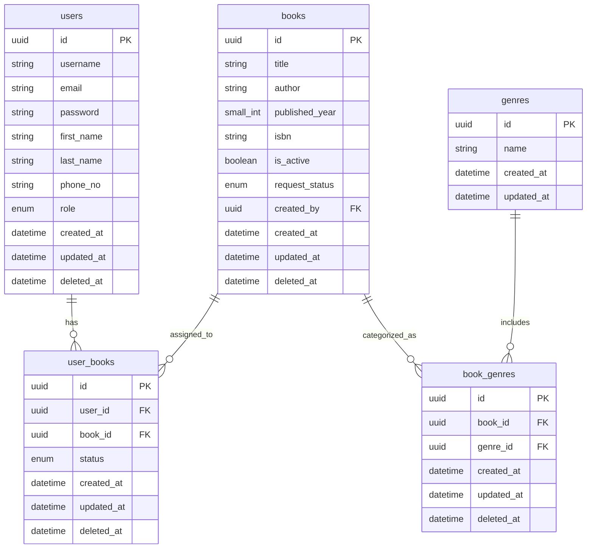

```mermaid
erDiagram
    users {
        uuid id PK
        string username
        string email
        string password
        string first_name
        string last_name
        string phone_no
        enum role
        datetime created_at
        datetime updated_at
        datetime deleted_at
    }

    genres {
        uuid id PK
        string name
        datetime created_at
        datetime updated_at
    }

    books {
        uuid id PK
        string title
        string author
        small_int published_year
        string isbn
        boolean is_active
        enum request_status
        uuid created_by FK
        datetime created_at
        datetime updated_at
        datetime deleted_at
    }

    user_books {
        uuid id PK
        uuid user_id FK
        uuid book_id FK
        enum status
        datetime created_at
        datetime updated_at
        datetime deleted_at
    }

    book_genres {
        uuid id PK
        uuid book_id FK
        uuid genre_id FK
        datetime created_at
        datetime updated_at
        datetime deleted_at
    }

    users ||--o{ user_books : has
    books ||--o{ user_books : assigned_to

    books ||--o{ book_genres : categorized_as
    genres ||--o{ book_genres : includes


```